# Schema Diagram — Asesor de Imagen AI

**Migration:** `004_consolidated_schema_v2.sql`  
**Last updated:** 2026-05-12 (Sprint 0.2 patch)

## Entity Relationship Diagram (12 tables)

```mermaid
erDiagram
    AUTH_USERS {
        uuid id PK
    }

    PROFILES {
        uuid id PK
        text first_name
        text last_name
        text avatar_url
        date date_of_birth
        text country_code
        text preferred_language
        jsonb notification_preferences
        timestamptz created_at
        timestamptz updated_at
        timestamptz deleted_at
    }

    SUBSCRIPTIONS {
        uuid id PK
        uuid user_id FK
        text plan_type
        text billing_provider
        text external_subscription_id
        text external_customer_id
        text status
        timestamptz trial_ends_at
        timestamptz current_period_start
        timestamptz current_period_end
        boolean cancel_at_period_end
        timestamptz canceled_at
        text currency
        int amount_cents
        timestamptz created_at
        timestamptz updated_at
    }

    WARDROBE_ITEMS {
        uuid id PK
        uuid user_id FK
        text image_url
        text storage_path
        text cdn_url
        text primary_color
        text category
        text size
        text brand
        text condition
        text[] user_tags
        jsonb metadata
        timestamptz created_at
        timestamptz updated_at
        timestamptz deleted_at
    }

    BODY_ANALYSIS {
        uuid id PK
        uuid user_id FK
        text image_url
        text body_type
        text skin_tone_category
        text color_season
        jsonb detected_colors
        jsonb best_colors
        jsonb avoid_colors
        int shoulder_width_cm
        int bust_cm
        int waist_cm
        int hip_cm
        int inseam_cm
        text notes
        jsonb vision_api_response
        timestamptz created_at
        timestamptz updated_at
    }

    TRY_ON_CACHE {
        uuid id PK
        text content_hash
        text result_image_url
        text result_storage_path
        text result_cdn_url
        text replicate_model_version
        int hit_count
        timestamptz created_at
        timestamptz last_hit_at
        timestamptz expires_at
    }

    TRY_ONS {
        uuid id PK
        uuid user_id FK
        uuid wardrobe_item_id FK
        uuid body_analysis_id FK
        uuid cached_from_id FK
        text content_hash
        boolean cache_hit
        text replicate_model_version
        text replicate_prediction_id
        int inference_time_ms
        text status
        text result_image_url
        text result_cdn_url
        text error_message
        decimal confidence_score
        int user_rating
        text fit_feedback
        text color_feedback
        text occasion_fit
        boolean would_buy
        boolean liked
        boolean shared
        timestamptz created_at
        timestamptz completed_at
        timestamptz updated_at
    }

    RECOMMENDATIONS {
        uuid id PK
        uuid user_id FK
        text occasion
        text season
        text reason
        decimal color_harmony_score
        decimal body_fit_score
        boolean clicked
        boolean liked
        boolean tried_on
        text claude_model_version
        text prompt_version
        timestamptz created_at
        timestamptz feedback_at
    }

    RECOMMENDATION_ITEMS {
        uuid recommendation_id FK
        uuid wardrobe_item_id FK
        int position
        text role
    }

    USER_STYLE_PROFILE {
        uuid user_id PK
        jsonb preferred_styles
        jsonb preferred_colors
        jsonb avoided_colors
        jsonb occasion_preferences
        jsonb favorite_brands
        decimal avg_price_point
        text budget_tier
        decimal trend_score
        text style_summary
        timestamptz calculated_at
        timestamptz updated_at
    }

    USAGE_COUNTERS {
        uuid user_id FK
        date period_start
        int try_ons_used
        int recommendations_used
        int body_analyses_used
    }

    IDEMPOTENCY_KEYS {
        text key PK
        uuid user_id FK
        text endpoint
        text request_hash
        int response_status
        jsonb response_body
        timestamptz created_at
        timestamptz expires_at
    }

    AUDIT_LOG {
        uuid id PK
        uuid user_id FK
        text action
        text resource_type
        text resource_id
        inet ip_address
        text user_agent
        text status
        text error_message
        jsonb metadata
        timestamptz created_at
    }

    AUTH_USERS ||--o| PROFILES : "1-to-1 (PK = auth.users.id)"
    AUTH_USERS ||--o{ SUBSCRIPTIONS : "user_id FK"
    AUTH_USERS ||--o{ WARDROBE_ITEMS : "user_id FK"
    AUTH_USERS ||--o{ BODY_ANALYSIS : "user_id FK"
    AUTH_USERS ||--o{ TRY_ONS : "user_id FK"
    AUTH_USERS ||--o{ RECOMMENDATIONS : "user_id FK"
    AUTH_USERS ||--o| USER_STYLE_PROFILE : "user_id PK"
    AUTH_USERS ||--o{ USAGE_COUNTERS : "user_id FK"
    AUTH_USERS ||--o{ IDEMPOTENCY_KEYS : "user_id FK"
    AUTH_USERS ||--o{ AUDIT_LOG : "user_id FK (nullable)"

    WARDROBE_ITEMS ||--o{ TRY_ONS : "wardrobe_item_id"
    BODY_ANALYSIS ||--o{ TRY_ONS : "body_analysis_id"
    TRY_ON_CACHE ||--o{ TRY_ONS : "cached_from_id"

    RECOMMENDATIONS ||--|{ RECOMMENDATION_ITEMS : "recommendation_id"
    WARDROBE_ITEMS ||--|{ RECOMMENDATION_ITEMS : "wardrobe_item_id"
```

## RLS Summary

| Table | User can READ | User can WRITE | Service-role writes |
|-------|:---:|:---:|:---:|
| `profiles` | ✅ own | ✅ own | via app layer |
| `subscriptions` | ✅ own | ❌ | webhooks only |
| `wardrobe_items` | ✅ own | ✅ own | via app layer |
| `body_analysis` | ✅ own | ✅ own | via app layer |
| `try_ons` | ✅ own | ✅ own | ARQ worker |
| `recommendations` | ✅ own | ✅ own | via app layer |
| `recommendation_items` | ✅ via parent | ✅ via parent | via app layer |
| `user_style_profile` | ✅ own | ✅ own | recommendation engine |
| `usage_counters` | ✅ own | ❌ [M6] | `increment_usage()` RPC only |
| `idempotency_keys` | ❌ | ❌ | service_role only |
| `try_on_cache` | ❌ | ❌ | service_role only |
| `audit_log` | ❌ | ❌ [M4] | service_role only |

> **Note:** `service_role` bypasses RLS by design (Supabase default).  
> The app-layer guard is `AdminClient.with_user_check()` in `app/core/admin_client.py`.

## Repository → Table Map

| Repository | Table | `id_column` |
|-----------|-------|-------------|
| `ProfileRepository` | `profiles` | `"id"` (PK = user id) |
| `WardrobeRepository` | `wardrobe_items` | `"user_id"` |
| `BodyAnalysisRepository` | `body_analysis` | `"user_id"` |
| `RecommendationRepository` | `recommendations` | `"user_id"` |
| `RecommendationItemRepository` | `recommendation_items` | ownership via parent |
| `TryOnRepository` | `try_ons` | `"user_id"` |
| `SubscriptionRepository` | `subscriptions` | `"user_id"` |
| `UserStyleProfileRepository` | `user_style_profile` | `"user_id"` |
| `UsageCounterRepository` | `usage_counters` | `"user_id"` |
